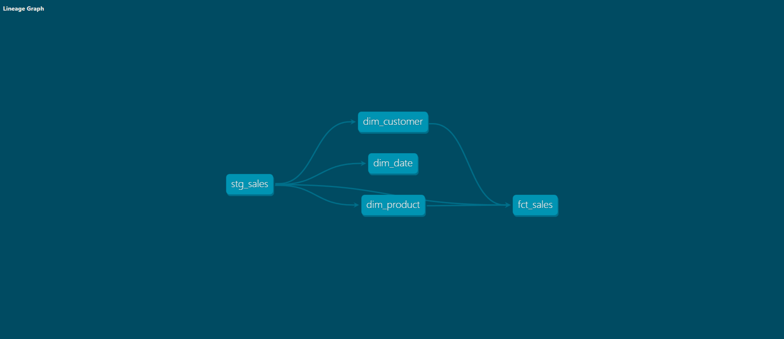

# Superstore Data Warehouse

A dimensional data warehouse built with dbt and PostgreSQL. Transforms raw sales data into a star schema with data quality tests, automated CI/CD, and documentation.

## Architecture

```
[raw_sales] (1000 rows, loaded via dbt seed)
     │
     ▼
[stg_sales] (Bronze - view)
     │  Cleaned types, calculated total_amount
     │
     ├── [dim_customer] (Silver - table)
     ├── [dim_product]  (Silver - table)
     └── [dim_date]     (Silver - table)
     │
     ▼
[fct_sales] (Gold - table)
     JOINs all dimensions
```

## Star Schema

| Table          | Type      | Grain                  | Row Count |
| -------------- | --------- | ---------------------- | --------- |
| `dim_customer` | Dimension | One row per customer   | 8         |
| `dim_product`  | Dimension | One row per product    | 10        |
| `dim_date`     | Dimension | One row per day        | ~1095     |
| `fct_sales`    | Fact      | One row per order line | 1000      |

## Data Quality

8 tests across all dimensions, automated on every push via GitHub Actions:

- `unique` on primary keys (customer_id, product_id, date_id)
- `not_null` on required fields
- `accepted_values` on customer segment

Run tests manually: `docker exec -it superstore_dbt dbt test`

## CI/CD

GitHub Actions workflow (`.github/workflows/dbt_test.yml`) runs on every push:

1. Starts PostgreSQL and dbt containers
2. Loads seed data (`dbt seed`)
3. Builds all models (`dbt run`)
4. Runs all tests (`dbt test`)

Green checkmark on the repo = all models built and all tests passing.

## Tech Stack

- **dbt 1.7** (data transformation)
- **PostgreSQL 15** (data warehouse)
- **Docker & Docker Compose** (containerization)
- **GitHub Actions** (CI/CD)
- **Python** (data generation)

## How to Run

1. Clone the repo

   ```
   git clone https://github.com/Lynixt/superstore-warehouse.git
   cd superstore-warehouse
   ```

2. Generate sample data and start services

   ```
   python generate_data.py
   docker compose up -d --build
   ```

3. Load data with dbt seed

   ```
   docker exec -it superstore_dbt dbt seed
   ```

4. Run models and tests

   ```
   docker exec -it superstore_dbt dbt run
   docker exec -it superstore_dbt dbt test
   ```

5. View documentation
   ```
   docker cp superstore_dbt:/usr/app/target ./dbt_docs
   cd dbt_docs
   python -m http.server 8081
   ```
   Open http://localhost:8081 for lineage graphs and documentation.

## Project Structure

```
dbt_project/
├── models/
│   ├── bronze/
│   │   └── stg_sales.sql
│   ├── silver/
│   │   ├── dim_customer.sql
│   │   ├── dim_product.sql
│   │   ├── dim_date.sql
│   │   └── schema.yml
│   └── gold/
│       └── fct_sales.sql
├── seeds/
│   └── raw_sales.csv
├── dbt_project.yml
└── profiles.yml
.github/
└── workflows/
    └── dbt_test.yml
```

## Lineage Graph



_Visual DAG showing data flow from raw seeds through Bronze (staging), Silver (dimensions), and Gold (fact table)._

## What I Learned

- Building a star schema from raw data
- dbt models, refs, materializations, and dependency graphs
- dbt seeds for automated data loading
- Data quality testing with schema.yml
- CI/CD with GitHub Actions
- Medallion architecture (Bronze → Silver → Gold)
- Lineage visualization with dbt docs
- Dimensional modeling: facts, dimensions, surrogate vs natural keys

## Portfolio

This is Project 2 of 3 in my data engineering portfolio.

- [Project 1: Broken Miner](https://github.com/Lynixt/Broken-Miner) - Airflow, Docker, PostgreSQL, Telegram alerts
- **Project 2: Superstore Warehouse** - dbt, dimensional modeling, CI/CD
